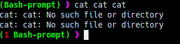
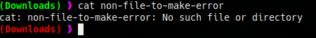
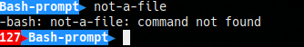
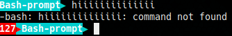
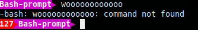

# Bash-prompt
bash prompts orignal and duplicates
### NOTE
      1) open  ~/.bashrc
      2) past the particular code at the end of the "~/.bashrc" file

### Glowin


```bash
# Glowin-basic from Bash-prompt
export HOME=$HOME/../..$HOME
PS1='\[\033[32;1m\]($(ym=$?;if [ $ym -ne 0 ];then printf "\[\033[31;1m\]$ym ";fi)\[\033[1;32;1m\]\W)\[\033[35m\] 》\[\033[00m\]'
```


```bash
export HOME=$HOME/../..$HOME
PS1='$(ym=$?;if [ $ym -ne 0 ];then printf "\[\033[31;1m\]($ym)";fi)\[\033[1;34;1m\](\W)\[\033[35m\] 》\[\033[00m\]'
```


```bash
export HOME=$HOME/../..$HOME
PS1='$(ym=$?;if [ $ym -ne 0 ];then printf "\[\033[31;1m\]$ym << ";fi)\[\033[1;32;1m\](\W)\[\033[35m\] 》\[\033[00m\]'
```


```bash
export HOME=$HOME/../..$HOME
PS1='\[\033[32;1m\](\t)-$(ym=$?;if [ $ym -ne 0 ];then printf "\[\033[31;1m\]($ym)-";fi)\[\033[1;32;1m\](\W)\[\033[35m\] 》\[\033[00m\]'
```


```bash
export HOME=$HOME/../..$HOME
PS1='$(ym=$?;if [ $ym -ne 0 ];then printf "\[\033[31;1m\]($ym)-";fi)\[\033[1;32;1m\](\t)-(\W)\[\033[35m\] 》\[\033[00m\]'
```



```bash
export HOME=$HOME/../..$HOME
PS1='$(if [ $? -ne 0 ];then printf "\[\033[31;1m\](\W)";else printf "\[\033[1;32;1m\](\W)";fi)\[\033[35m\] 》\[\033[00m\]'
```

### Airline 


```bash
export HOME=$HOME/../..$HOME
END=""
PS1='$(ym=$?;if [ $ym -ne 0 ];then printf "\[\033[41m\]\[\033[37;1m\]$ym\[\033[0m\]\[\033[31;1m\]\[\033[44m\]$END";fi)\[\033[44m\]\[\033[37;1m\]\W\[\033[0m\]\[\033[34m\]$END\[\033[00m\] '
```


```bash
export HOME=$HOME/../..$HOME
END=""
PS1='$(ym=$?;if [ $ym -ne 0 ];then printf "\[\033[41m\]\[\033[37;1m\]$ym\[\033[0m\]\[\033[31;1m\]\[\033[46m\]$END";fi)\[\033[46m\]\[\033[37;1m\]\W\[\033[0m\]\[\033[36m\]$END\[\033[00m\] '
```


```bash
export HOME=$HOME/../..$HOME
END=""
PS1='$(ym=$?;if [ $ym -ne 0 ];then printf "\[\033[41m\]\[\033[37;1m\]$ym\[\033[0m\]\[\033[31;1m\]\[\033[45m\]$END";fi)\[\033[45m\]\[\033[37;1m\]\W\[\033[0m\]\[\033[35m\]$END\[\033[00m\] '
```

### Powerline 


```bash
export HOME=$HOME/../..$HOME
END="▶"
PS1='$(ym=$?;if [ $ym -ne 0 ];then printf "\[\033[41m\]\[\033[37;1m\]$ym\[\033[0m\]\[\033[31;1m\]\[\033[44m\]$END";fi)\[\033[44m\]\[\033[37;1m\]\W\[\033[0m\]\[\033[34m\]$END\[\033[00m\] '
```


```bash
export HOME=$HOME/../..$HOME
END="▶"
PS1='$(ym=$?;if [ $ym -ne 0 ];then printf "\[\033[41m\]\[\033[37;1m\]$ym\[\033[0m\]\[\033[31;1m\]\[\033[46m\]$END";fi)\[\033[46m\]\[\033[37;1m\]\W\[\033[0m\]\[\033[36m\]$END\[\033[00m\] '
```


```bash
export HOME=$HOME/../..$HOME
END="▶"
PS1='$(ym=$?;if [ $ym -ne 0 ];then printf "\[\033[41m\]\[\033[37;1m\]$ym\[\033[0m\]\[\033[31;1m\]\[\033[45m\]$END";fi)\[\033[45m\]\[\033[37;1m\]\W\[\033[0m\]\[\033[35m\]$END\[\033[00m\] '
```

